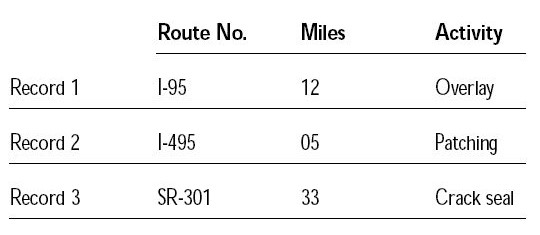

## Analysis of RDMS (SQL)

### Abstract
### Introduction
At the time of implementation of any system, most of the problems faced are because of the outcome of a poor database design. In most of the cases it occurs that the system must be modified continuously in different regards because of the change in requirement of the users[1]. Thus, a need for a data storage system which provides a flexible, convenient, and effective method of defining, storing, and retrieving the information is fulfilled by relational database design. 

The traditional database systems have been based on the relational model which are broadly known as SQL databases, as they are named after the language they were queried by. In Relational Database Management System (RDBMS) data is organized in database tables, fields, and records. Every RDBMS tables contains database table rows. Every database table row contains one or more database table fields. RDBMS collects the data into collection of tables, that might be related by common fields (database table columns). Most RDBMS uses SQL as database query language to store, access and perform various operations on the data stored in the database. RDBMS also gives relational operators to control the data collected into the database tables. The most famous RDBMS are MySQL, PostgreSQL, and Oracle Database. The aim of the relational database design is to produce a set of relation schema that allows us to store information without unnecessary redundancy and it retrieves information easily. The relational data model is the most used model, and a large majority of present database systems are based on the relational model[1].

Figure 1 RDBMS Structure [2]

### Background

Storage of information in the form of computerized databases started in early 1960s, when various governmental offices, businesses, libraries etc. saw the cost-effective option with the use of computers. The most popular data models currently were the network database model, the hierarchical database model, and the flat-file database model [3]. Many of these models had various disadvantages such as complex representation of database, lack of structural independence and no support for many to many relationships [4].

Figure 2 Flat File Database model

Figure 3 Hierarchical Database Model

#### RDBMS
RDBMS overcame most of these limitations by providing simple database design, a language to access data easily, support for large amounts of data with multi-level relationships between data sets and many more. Dr. E.F. Codd, an IBM research scientist and mathematician, designed the relational model. Also, in this model, the database’s schema is disconnected from physical information storage, and this became the standard principle for database systems [3]. The main focal points of this model were to further reduce data redundancy and to improve data integrity within database systems [1]. In RDBMS, the data is stored in tables, or relations and these tables are divided into rows (records) and columns (fields). Relational databases are famous for handling multitudes of data and complex queries.

Both RDBMS and NoSQL databases provide various benefits of their own and aim to solve a single problem i.e. an efficient way to store information, but neither is a universal solution for every application. The developer must learn the advantages and disadvantages of each and choose the database based on the optimal set of tradeoffs that one can make based on their application. To explicate our analysis and to establish the differences between RDBMS and NoSQL, we choose PostgreSQL, a free and open-source RDBMS and MongoDB, a document-oriented NoSQL database. Both the databases are multi-platform software.

### Analysis of rdbms and nosql (Postgres, mongodb)
1. Design principles and theorems
2. Indexing
3. data models  
4. comparison(PostgreSQL and MongoDB)
5. Security features
### Case study (big data)
### Conclusion
### References
1. Introduction to RDMS [http://www.rjspm.com/PDF/BCA-428%20Oracle.pdf](http://www.rjspm.com/PDF/BCA-428%20Oracle.pdf)
2. Relational database [https://en.wikipedia.org/wiki/Relational_database](https://en.wikipedia.org/wiki/Relational_database)
3. Network and hierarchical Database Models [https://www.quickbase.com/articles/timeline-of-database-history#:~:text=1980s,network%20and%20hierarchical%20database%20models](https://www.quickbase.com/articles/timeline-of-database-history#:~:text=1980s,network%20and%20hierarchical%20database%20models)
4. Hierarchical Database Model [https://www.ukessays.com/essays/information-technology/hierarchical-data-model.php](https://www.ukessays.com/essays/information-technology/hierarchical-data-model.php)
