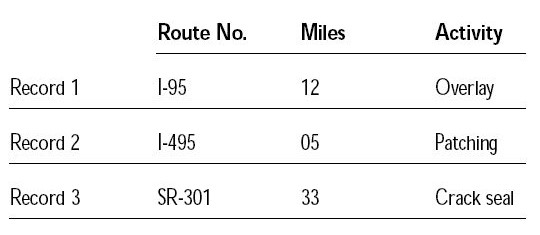
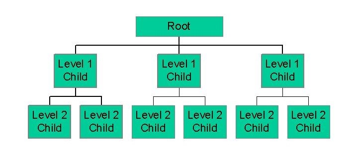
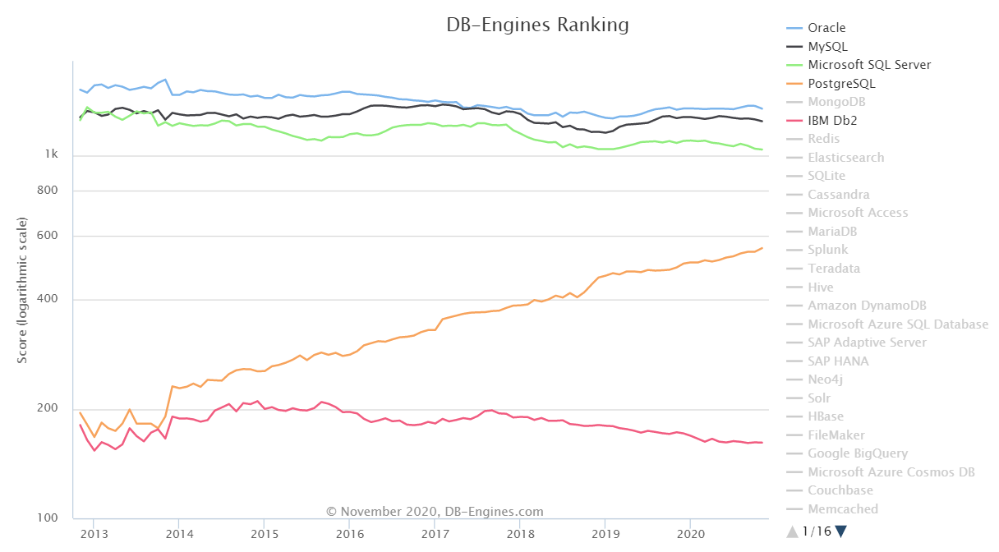
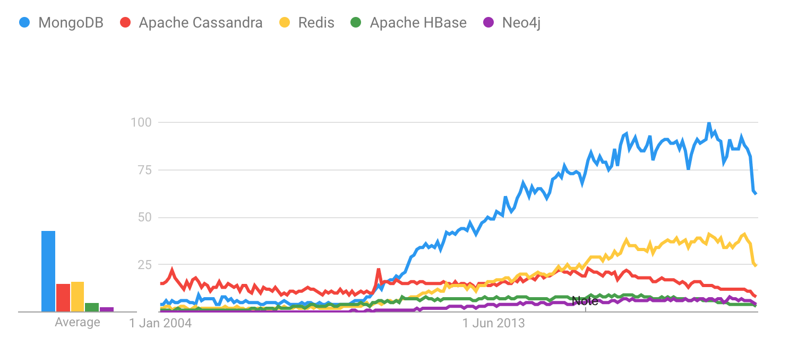
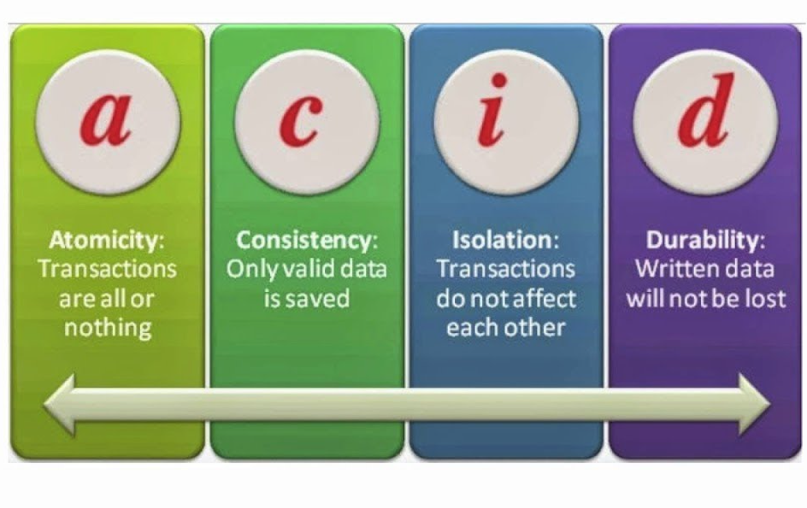
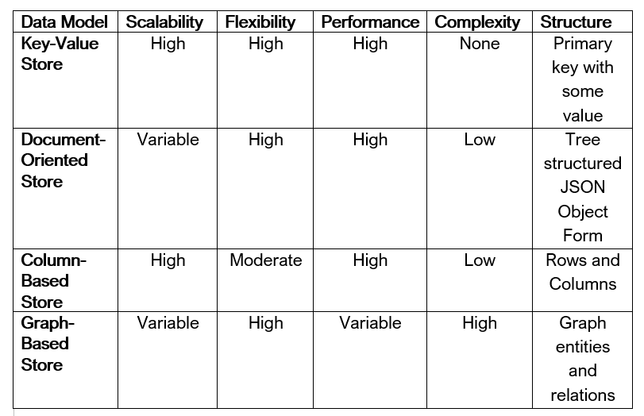
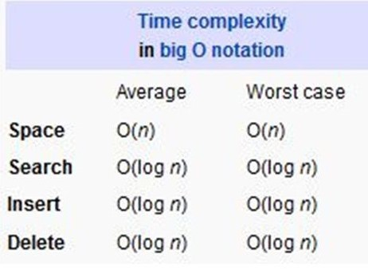
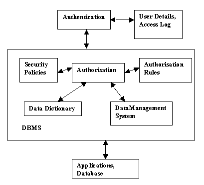
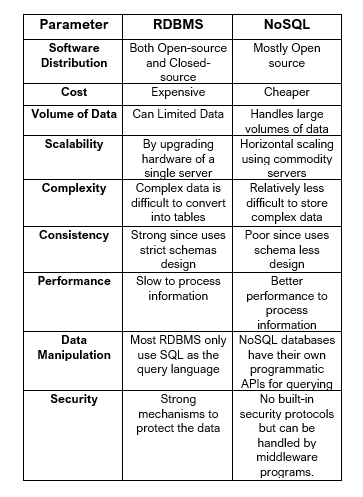

## Analysis of RDMS (SQL)

### Abstract
### Introduction
At the time of implementation of any system, most of the problems faced are because of the outcome of a poor database design. In most of the cases it occurs that the system must be modified continuously in different regards because of the change in requirement of the users[1]. Thus, a need for a data storage system which provides a flexible, convenient, and effective method of defining, storing, and retrieving the information is fulfilled by relational database design. 

The traditional database systems have been based on the relational model which are broadly known as SQL databases, as they are named after the language they were queried by. In Relational Database Management System (RDBMS) data is organized in database tables, fields, and records. Every RDBMS tables contains database table rows. Every database table row contains one or more database table fields. RDBMS collects the data into collection of tables, that might be related by common fields (database table columns). Most RDBMS uses SQL as database query language to store, access and perform various operations on the data stored in the database. RDBMS also gives relational operators to control the data collected into the database tables. The most famous RDBMS are MySQL, PostgreSQL, and Oracle Database. The aim of the relational database design is to produce a set of relation schema that allows us to store information without unnecessary redundancy and it retrieves information easily. The relational data model is the most used model, and a large majority of present database systems are based on the relational model[1].

 
Figure 1 RDBMS Structure [2]
 
 

NoSQL is also known as non-relational database management systems. NoSQL is different from relational database management system (RDBMS).  It is designed for large amount of data which is distributed across servers. This type of database requires no fixed schemas, join operations and horizontal scaling [18]. 

In relational database, schema need to be defined before inserting data into the data whereas NoSQL databases require no defined schemas before data entry. Without affecting the applications, schema can be constructed at any time. We can also change the data structure at any time.  RDBMS requirements to perform SQL join activities to blend at least two relations simultaneously, which can prompt execution bottlenecks. NoSQL has no join operations so data retrieval is fast. NoSQL also allows different and unstructured data. NoSQL is used for session store, mobile apps, e-commerce [19]. 

### Background

Storage of information in the form of computerized databases started in early 1960s, when various governmental offices, businesses, libraries etc. saw the cost-effective option with the use of computers. The most popular data models currently were the network database model, the hierarchical database model, and the flat-file database model [3]. Many of these models had various disadvantages such as complex representation of database, lack of structural independence and no support for many to many relationships [4].

 
Figure 2 Flat File Database model

 
Figure 3 Hierarchical Database Model

#### RDBMS
RDBMS overcame most of these limitations by providing simple database design, a language to access data easily, support for large amounts of data with multi-level relationships between data sets and many more. Dr. E.F. Codd, an IBM research scientist and mathematician, designed the relational model. Also, in this model, the database’s schema is disconnected from physical information storage, and this became the standard principle for database systems [3]. The main focal points of this model were to further reduce data redundancy and to improve data integrity within database systems [1]. In RDBMS, the data is stored in tables, or relations and these tables are divided into rows (records) and columns (fields). Relational databases are famous for handling multitudes of data and complex queries.

Both RDBMS and NoSQL databases provide various benefits of their own and aim to solve a single problem i.e. an efficient way to store information, but neither is a universal solution for every application. The developer must learn the advantages and disadvantages of each and choose the database based on the optimal set of tradeoffs that one can make based on their application.

#### NoSQL

Data is produced and prepared more quickly now than any other time before. Lately as more than 2.5 trillion of Data is created consistently. Data will keep on expanding in volumes later at an outstanding level.  This developing interest brought about various NoSQL Database Management Systems (DBMS’s), with an emphasis on execution, depend-ability, and consistency. Various existing ordering structures were reused and refined to upgrade search and read execution.
 
The SQL scalability issue was perceived by organizations with tremendous, developing information and foundation needs, for example, Google, Amazon, and Facebook. They concocted their own answers for the issue – advancements like Big Data, DynamoDB, and Cassandra. NoSQL stands for “Not only SQL”.  The data in the NoSQL is not stored as tables that is in Relational Databases. NoSQL has a SQL like syntax.  NoSQL Databases offers straight forward plan, better control on accessing data by sup-porting horizontal scaling for many machines. 
 
Sometimes, database structure of NoSQL is flexible than Relational Database models.  The utilization of NoSQL databases is expanded essentially because of its use which incorporates factors like low-level query language, high normalized interfaces and less ventures when contrasted with relational databases, it additionally offers consistency regarding speed, segment resistance and accessibility. 
 
Advantages of working with NoSQL databases are Scalability and Availability. 
 
**Sharding** is a technique where data is partitioned and distributed to several servers. Vertical scaling is where resource capacity of the existing server is increased. Most of the NoSQL databases are horizontally scalable using sharding technique. 
 
**Availability** NoSQL databases are profoundly accessible as highlight to auto replication which recreates to past steady state if there should be an occurrence of data failure.

To explicate our analysis and to establish the differences between RDBMS and NoSQL, we choose PostgreSQL, a free and open-source RDBMS and MongoDB, a document-oriented NoSQL database. Both the databases are multi-platform software.

##### PostgreSQL
PostgreSQL (postgres) is a powerful and object-relational database system that uses SQL language. The PostgreSQL, written in C, was first developed in 1986 which originated as the successor of Ingres data and has more than 30 years of active development on the core platform [5].

 
Figure 4 Popular RDBMS Engine Rankings
 
Label - PostgreSQL is gaining more popularity and is been adapted by many developers over legacy databases like MySQL, Oracle, IBM DB and Microsoft SQL. 

PostgreSQL has earned a strong reputation for its proven architecture, reliability, data integrity, robust feature set, extensibility, and the dedication of the open source community behind the software to consistently deliver performant and innovative solutions. PostgreSQL supports all major operating systems and is highly extensible such as, it provides a way to define your own data types, functions and supports code from different programming languages [5]. PostgreSQL has proven to be highly efficient, secure, flexible, and scalable in storing, managing, and accessing the data stored. Some of the top tech companies to use postgres are Reddit, The Guardian and Instagram. This database has also been recognized for its robust and efficient way to accommodate multiple concurrent users [6].

#### MongoDB

MongoDB is a horizontally scalable, document-oriented NoSQL Database. The software is written in C++ and uses JSON-like documents.  MongoDB architecture consists of collections and documents. Tables are known as collections and records are known as documents. Document is a data structure where data is composed of field and value pairs. 
 

 
Figure 5 Popular NoSQL DB Engine Rankings
 
Label - MongoDB is the most popular and widely used NoSQL database in the industry currently and is surpassing all other NoSQL databases in rankings. 

MongoDB can store any sort of information and hence-forth does not need any predefined patterns. This gives the client greater adaptability while making new fields in document. Document-oriented databases are substantially more adaptable. The structure of every document does not need to be consistent. Indeed, even enormous volumes of unstructured information can be obliged in the database.

#### Features of MongoDB

**Schema-less Database:** Different types of documents can be held by the collection. Documents can be of varying number of fields and size. This provides great flexibility to database.
 
**Document-Oriented:** Data is stored in documents in key-value pairs. Each document is assigned a unique object id. 
 
**Indexing:** Each field in the document is ordered with indices. This makes it simpler and sets aside less effort to get or look through information from the huge amount of data.
 
**Scalability:** Using sharding technique, data is distributed to multiple servers using shard key. New servers can be added to the running database.
 
**Replication:** MongoDB duplicates data and send them to multiple servers increasing data availability. 
 
**Aggregation:** MongoDB allows aggregation operations which takes grouped data and produces single output. It provides three different aggregations i.e., aggregation pipeline, map-reduce function, and single-purpose aggregation methods
 
**High Performance:** MongoDB has high performance and persistence of data because of above features.

### Analysis of rdbms and nosql (Postgres, mongodb)

#### RDBMS

##### Design principles

Dr. E. F. Codd defined twelve principles [7] of relational databases which continue to be the litmus test for database programs to validate their “relational” characteristic. These rules only apply to the database engine rather than to the applications development and the database engine that does not meet all the rules is not fully ‘relational’. Though most of the modern databases does not comply with all the rules, they still are considered relational. 

In a well-designed relational database data is stored in the form of tables and can be accessed at any time. Each table comprises of rows and columns. The data here is stored in the form of objects. A proper RDBMS contains no duplicate rows, and each table has a primary key, a unique identifier constructed from one or more columns [8]. A table can be linked to another table through the other table’s primary key. The column (key) of the current table which is referencing the other table’s primary key is called the Foreign key. A table can have multiple foreign keys. Along with tables RDBMS also have views which are searchable objects. Though data will not be stored in the views, they are referred to as virtual tables since they can be queried like tables [9]. RDBMS has an interesting feature called referential integrity. Referential integrity states that a value to be entered in the foreign key field should be in the primary key field first. In RDBMS systems data must closely follow the database definition. If for some reason, there is any discrepancy then database will throw an error [8].

##### Properties

The two basic properties of RDMS are CRUD, the necessary operations to implement a persistent storage application and ACID, the properties to maintain consistency across the database.

**CRUD** – stands for Create, Read, Update and Delete. These are the basic operations that the RDBMS must allow on the records in the database. These functions are not only performed on the object records but also on the indexes used to search those records. The database engine must provide the interface for the user to perform these operations, to read or modify the data, on the database. Most the RDBMS use SQL language to perform CRUD operations or to communicate with the database [10].

**ACID** – stands for Atomicity, Consistency, Isolation and Durability. These are the methods that attempt to define and solve the concurrency issues in the RDBMS. Atomicity defines that any transaction must be atomic i.e. must be completed in full or must be never done. This methods groups all the data together as single unit, as an atomic unit of data. Consistency defines that the database must maintain a stable state, be consistent, before and after any transaction(s) rather than an in-consistent or corrupted state. Isolation defines that multiple transactions can occur concurrently, each in its own isolated state without interference and without leading to any inconsistency in the database. Durability defines that the data, once written or modified in the database, must be written to the disk and persist even if a system failure occurs [10].    

 
Figure 6 RDBMS ACID properties
 
Label - All the relational database systems must support the above CRUD and ACID properties. 

#### NoSQL

##### Design Principles  

NoSQL gives an API and utilizes decentralized engineering for the replication of data. 

**Data Models In NoSQL**
 
There are 4 types of data models in NoSQL.

**Key-value store:** Uses key value pairs to store the data in the database. Keys must be unique, and values can be of any data type including URLs. Key length varies from database to database. The size of the key is significant here, as a long key can cause execution issues though too short a key can cause coherence issues. Key-value database models are useful for Ecommerce. Examples are Oracle NoSQL database and Redis.

**Document-oriented store:** It is a semi-structured data where records and its metadata are stored in the same document. Data encoding is done like XML or JSON. This type of databases is used in big data analysis. Examples are MongoDB and Couchbase.

**Column-based store:** Data is stored on columns instead of rows. All operations are done on columns. Storing data in columns results in fast access and retrieval of data. They are highly scalable and are used in Data mining. Examples are HBase, Big Table, Cassandra.

**Graph-based store:** Graphical representation is used to store data. Object is stored as node and properties associated. Connection to other objects/nodes are represented by relationship. Data can be efficiently transformed from one model to another. Rule of graph-based database is that node cannot be deleted unless all its relationships are removed. These databases are used in analyzing social media networks. Examples are Info Grid and Infinite Graph.

 
Figure 7 NoSQL DMS

##### Properties
 
**BASE** - NoSQL databases follow BASE (Basically Available, Soft State, Eventual consistency) principles.
 
* Basically Available:  This states that the system ensures the accessibility of the data.

* Soft State: Data are in changing state over the long haul without a user’s potential contribution.

* Eventual consistency: The system becomes eventually consistent as it is state will be modified when receiving input is stopped. Eventually the information is updated maintaining consistent database.
 
**CAP** - stands for Consistency, Availability, and Partition tolerance.
 
* Consistency: Data existing on all machines must be indistinguishable after all update operations.
* Availability: Data ought to be made open forever rather than transitory access.
* Partition tolerance: Partition Tolerance is an assurance that the framework keeps on working notwithstanding subjective message loss or failure of part of the framework. Regardless of whether there is a network outage in the server and a portion of the PCs are in accessible, still, the system keeps on performing.

 

#### Indexing

In DBMS, Indexing is a special data structure technique which allows the user to look up the records from the database efficiently [11] i.e. indexing is associating a key to its data record. This data structure, known as index, contains two columns – the first column holds the primary or candidate key of the table and the second column contains the pointers of the address of the data in the disk. The indexing technique defines the type of file system of a database. There are various types of indexing techniques such as Primary Indexing or Sequential File Organization, Secondary Indexing or Hash File Indexing and Multi-level Indexing [12]. Each indexing technique has its own algorithm and the database engine, or the user has the option to use the best suited technique to different types of queries.

##### RDBMS

PostgreSQL provides several indexing techniques such as B-Tree, Hash and Gist [13]. By default, PostgreSQL, and many other RDBMS engines, uses B-Tree indexing which is the best fit for most common queries.

 
Figure 8 Sample B-Tree

**B-Tree** is the widely used, multi-level indexing format and self-balancing tree data structure in DBMS which stores data in its node in sorted order. The main purpose of the B-tree is to significantly reduce the times of disk access. All the leaf nodes of the B-tree signify actual data pointers and each node has two references to its two child nodes. In self-balancing search trees, it is assumed that all the data is in the main memory. Usually, the node-size or height of the B-tree is kept equal to the disk block size and thus total disk access for most operations are reduced significantly. This total disk accesses of B-tree is lower than those of other balanced Binary Search Trees like AVL, O2-Tree [14]. 

Most popular B- Tree is B+-Tree where all keys are stored in leave nodes. Leaf nodes are connected to give requested access to the records. Some of the values of the key values show up in the internal nodes, to just go about as a medium to control the looking of a record. B+-Tree of n elements and t degree must satisfy below properties*.
Each node contains at least (t-1)/2 keys.
All nodes contain t -1 keys.
Each node has number of keys in that node plus 1 child.
All leaves are at same level.
Degree of the tree depends on the block size in the disk.

 
Figure 9 B-Tree Complexities

##### NoSQL

There are various indexing techniques in NoSQL. Like SQL databases NoSQL databases also use B-Tree indexing. Two more widely used indexing techniques are T-tree and O2-tree indexing.

**T-Tree Indexing:** The structure of T-Tree is the combination of both AVL-Trees and B-Trees.  AVL-Trees are self-balancing binary trees while B-Trees are unbalanced trees with varying child node for each node.
There are three types of nodes in T-Trees. 	T-node has a right child and left child, half node has only one child, and a leaf node has no children. Each node has more than one pair of tuples {key-value, pointer}. While there is comparability in query operations with that of AVL-Tree, T-Trees offer better execution over them.
 
**O2-Tree Indexing:** It is the combination of Red-Black Tree and Binary Search Tree where leaf node contains the tuples {key-value, pointer}. O2-Tree enhances the current indexing method. O2-Tree of order m (m greater than or equal to 2) must satisfy below properties*. 
Each node is either red or black. Root node is always black.
Red node has both children black.
Each leaf node is black and contains tuple.
Leaf nodes have tuples between m/2 to m.
Leaf nodes are doubly linked both in forward and backward directions.
 

#### Security features

**RDBMS Security**

Database security is essential for a database to protect the data stored in it, to preserve the integrity or confidentiality and to maintain the user privileges across the database. Thus, the database security measures must include protecting the underlying infrastructure of the database system, enforce backup strategies and access to the data itself [15]. Some of the key considerations for addressing these potential security issues and to keep the any database secure are 

**Identification and Authentication requirements:** Databases can be accessed by users through various means. Authentication can be done by operating system or database.

**Reviewing DB users and passwords:** Get a rundown of all User Accounts and role of each user account. Roles of user account must be reviewed to make sure users are having appropriate privileges. There should be a few rules for picking the passwords and clients ought to be confined.

**Application system connections:** Enterprise applications are directly connected to the database with hardcoded passwords that change rarely. Those passwords must be encrypted and stored in user inaccessible areas.

**Logging and Monitoring:** Data usage and user activities must be logged and monitored. 

**Backup and Recovery:** Guarantee that a proper recovery and backup technique exists.

**Vulnerability Analysis:** Known vulnerability assessment must be performed at regular time intervals. Proper action must be taken to mitigate.

 
Figure 10 DBMS Security

**PostgreSQL**

PostgreSQL comes in with some good built-in security features and is addressed in various levels of the database management software [16]. Some of the important security features provided by Postgres are 
* Database File Protection – All the files/data stored in the database are restricted from access, to read and modify, except for by the Postgres superuser.
* User and Group Privileges – The superuser has the options to issue database or file access to other users directly or by creating groups and assigning the users to the groups. These groups can have limited or definite permissions to access a table, database, or file and can also define type of access to the respective. 
* Control over Remote connections – By default, Postgres only allows local connections over Local Unix Socket [16]. The backend server must be started manually to allow non-local connections. The superuser can also configure/restrict these non-local clients to a particular IP address or to a set of IP domains.

PostgreSQL has a flexible yet powerful built-in security methods to protect the database from exploits. But these methods must be properly implemented and configured based on the application the database is used for. No configuration is ideal to every application and thus is not secure from every vulnerability [17].

**MongoDB**

Security was not an essential worry of MongoDB's designers. Thus, there are many "loopholes" in its design. Data files in MongoDB are unencrypted and there are no techniques that would automatically encrypt sensitive information. 
Explicit encryption of sensitive data must be implemented at operating system level.
JavaScript is the internal scripting language in MongoDB that is vulnerable to SQL injection attack.
Auditing actions on database in MongoDB is not provided. MongoDB stored information only about database creation but does not store about inserts, updates or deletes.  

#### Comparison(PostgreSQL and MongoDB)

There are various parameters to determine the better type of database over other. Some of the most important features and criteria for comparison of the database management system are 

**Software distribution** 

This may be one of the key factors that can the decide the database for an application. Relational databases are available in both open-source and closed-source whereas most of the NoSQL database systems are open-source programs. Proprietary database systems tend to have greater security but lack personalization. 

**Cost**

Price of the database systems can be a deciding factor if the application, the database is used for, needs large amounts of data storage which may lead to great amount of investments. Most proprietary database systems are expensive when compared to open-source database systems. Additional hardware upgrades also add up to the database maintenance charges. While most NoSQL databases are open-sourced, they tend to be inexpensive and can also be modified to personal use. By using virtual machines instead of commodity servers and leveraging the benefits of inexpensive software, one can further reduce the investments.

**Volume of Data**

The emergence of internet and social media applications on web have increased the volume and variety of data. Thus, the databases are expected to handle such large amounts of data effectively and efficiently. Relational databases have failed to handle big data because it lacks in high velocity since it was designed more towards steady data processing rather than rapid growth. This inability of RDBMS led to large tech companies like Google, Facebook shift towards NoSQL which has proven to handle data intensive applications.

**Scalability**

Both RDBMS and NoSQL databases are usually scalable, but RDBMS have a certain limit and this limit is particularly hardware dependent which are sometimes fixed by design and unaltered. Hardware upgrading a server, or a database increases the effort for the database administrator. Whereas NoSQL offers great scalability by horizontal scaling and is simple, cheaper, and not restricted by hardware limitations. This is one of the reasons why large tech and social media companies are migrating to NoSQL.

**Complexity**

Relational databases strictly follow database schemas for creating databases and tables which makes it difficult to convert raw data into relation tables. Also, relational databases require large and complex queries to read, modify or create data. Whereas NoSQL required no design schemas or relations between the data or no large and complex queries read, modify, or create data. NoSQL also supports both structured and unstructured data which makes it easier to store any form of raw data. Therefore, no skill is comparatively less complex and simple than relational databases.
 
**Consistency**

Since relational database tables our design using strict schemas, they offer strong consistency. This provides uniform you of data but with less flexibility and availability. This makes sense since relational databases are required to follow ACID properties which strictly promotes consistency in the database systems. NoSQL databases are designed to support wide variety of data and since the data is created without no strict schemas, they offer less consistency. NoSQL aims to provide more flexibility and availability rather than consistency.

**Performance** 

RDBMS require much time to load and process the data then NoSQL database system. relational databases serve information primarily from non-volatile memory whereas NoSQL systems serve the data from volatile memory. Thus, by design time taken to retrieve the information from RDBMS is comparatively longer than the time taken by NoSQL databases.   
This is one of the main reasons for large web applications to use NoSQL databases rather than relational databases.

**Data Manipulation Language**

Relational databases are confined to use a single query language for the data manipulation. Most of the relational databases use SQL for this purpose And SQL has become a standard with great documentation and wide community . However, some databases have their own variation of SQL language. Since there is only one universal language which works with most of the relational databases, developers do not have much problem using a new relational database. 
NoSQL databases does not have a standard of any kind for querying by design and does not have a query language. NoSQL databases provides an API which can be used to query data. So, these databases support programmatic querying through their own unique APIs.
Some NoSQL databases like MongoDB support various popular programming languages like Python, JavaScript, Scala for data querying directly from their applications.

**Security** 

Database systems, in general, face some serious security challenges such as SQL/NoSQL injection and cross site scripting. Security is a substantial part of relational database systems where are in the NoSQL database systems security is handled by middleware programs. So, in RDBMS there's too little effort needed to secure a database from potential threats. Whereas in NoSQL database systems the developer or the administrator must need to put in some effort to configure and setup the required security for the applications. Also, these security measures must be implemented in such a way that it does not interrupt or compromise the databases’ flexibility, scalability, and performance. 

 
Figure 11 RDBMS-NoSQL Comparison [18]
 
 

### Case study (big data)
### Conclusion
### References
1. Introduction to RDMS [http://www.rjspm.com/PDF/BCA-428%20Oracle.pdf](http://www.rjspm.com/PDF/BCA-428%20Oracle.pdf)
2. Relational database [https://en.wikipedia.org/wiki/Relational_database](https://en.wikipedia.org/wiki/Relational_database)
3. Network and hierarchical Database Models [https://www.quickbase.com/articles/timeline-of-database-history#:~:text=1980s,network%20and%20hierarchical%20database%20models](https://www.quickbase.com/articles/timeline-of-database-history#:~:text=1980s,network%20and%20hierarchical%20database%20models)
4. Hierarchical Database Model [https://www.ukessays.com/essays/information-technology/hierarchical-data-model.php](https://www.ukessays.com/essays/information-technology/hierarchical-data-model.php)
5. Official PostgreSQL Site - About [https://www.postgresql.org/about/](https://www.postgresql.org/about/)
6. PostgreSQL WikiPedia [https://en.wikipedia.org/wiki/PostgreSQL](https://en.wikipedia.org/wiki/PostgreSQL)
7. Principles of Relational Databases [https://www.oreilly.com/library/view/sql-in-a/1565927443/ch01s05.html](https://www.oreilly.com/library/view/sql-in-a/1565927443/ch01s05.html)
8. Referential Integrity and Relational Database Design [https://web.mit.edu/11.521/www/lectures/lecture10/lec_data_design.html](https://web.mit.edu/11.521/www/lectures/lecture10/lec_data_design.html)
9. Relational Database View [https://www.essentialsql.com/what-is-a-relational-database-view/#:~:text=A%20database%20view%20is%20a,contain%20a%20subset%20of%20information](https://www.essentialsql.com/what-is-a-relational-database-view/#:~:text=A%20database%20view%20is%20a,contain%20a%20subset%20of%20information)
10. ACID and CRUD operations [https://informationtechsales.blogspot.com/2014/11/databases-sql-crud-and-acid-102.html](https://informationtechsales.blogspot.com/2014/11/databases-sql-crud-and-acid-102.html)
11. RDBMS Indexing basics [https://datageek.blog/en/2018/06/05/rdbms-basics-indexes-and-clustered-indexes/](https://datageek.blog/en/2018/06/05/rdbms-basics-indexes-and-clustered-indexes/)
12. Indexing in DBMS [https://www.guru99.com/indexing-in-database.html](https://www.guru99.com/indexing-in-database.html)
13. PostgreSQL Documentation - Indexing [https://www.postgresql.org/docs/9.5/indexes-types.html#:~:text=PostgreSQL%20provides%20several%20index%20types,fit%20the%20most%20common%20situations](https://www.postgresql.org/docs/9.5/indexes-types.html#:~:text=PostgreSQL%20provides%20several%20index%20types,fit%20the%20most%20common%20situations)
14. Introduction to B-tree [https://www.geeksforgeeks.org/introduction-of-b-tree-2/](https://www.geeksforgeeks.org/introduction-of-b-tree-2/) 
15. DBMS Security [https://www.imperva.com/learn/data-security/database-security/#:~:text=The%20most%20common%20ways%20that,for%20compromises%20are%20as%20follows](https://www.imperva.com/learn/data-security/database-security/#:~:text=The%20most%20common%20ways%20that,for%20compromises%20are%20as%20follows)
16. Security in PostgreSQL - PostgreSQL Documentation [https://www.postgresql.org/docs/7.0/security.htm](https://www.postgresql.org/docs/7.0/security.htm)
17. Vulnerabilities in PostgreSQL [https://www.upguard.com/blog/10-ways-to-bolster-postgresql-security](https://www.upguard.com/blog/10-ways-to-bolster-postgresql-security)
18. A Comparative Study of NoSQL and Relational Database [https://www.researchgate.net/publication/326019759_A_Comparative_Study_of_NoSQL_and_Relational_Database](https://www.researchgate.net/publication/326019759_A_Comparative_Study_of_NoSQL_and_Relational_Database)